# DTU Unite

DTU Unite is a full-stack social platform built for the Delhi Technological University (DTU) community. It enables students, alumni, and faculty to connect, share, and collaborate in a secure and modern environment.

---

## 🚀 Features

- **Modern Authentication:** Secure sign-up/login with OTP-based email verification.
- **Responsive UI:** Mobile-first design with light/dark mode support.
- **Social Feed:** Create posts, like/dislike, and comment in real-time.
- **User Profiles:** Custom avatars, profile info, and activity history.
- **Feedback System:** Users can submit feedback directly from the app.
- **Professional Email Notifications:** Clean, branded OTP and notification emails.
- **Accessibility:** Designed for usability and accessibility.

---

## 🛠️ Tech Stack

<p align="center">
  
  
  
  
  
  
  
  
</p>

**Frontend:**
- React.js
- Material UI
- Bootstrap
- Axios

**Backend:**
- Node.js
- Express.js
- MongoDB (Mongoose)
- Nodemailer (for OTP/email)
- JWT (for authentication)

**Other:**
- Cloudinary (for image uploads)
- Deployed on (add your deployment platform, e.g., Vercel/Render/Netlify)

---

## 📦 Installation

### Prerequisites
- Node.js & npm
- MongoDB database (Atlas or local)
- Google account for sending emails (App Password required)

### 1. Clone the repository
```sh
git clone https://github.com/yourusername/dtu-unite.git
cd dtu-unite
```

### 2. Backend Setup
```sh
cd backend
npm install
```
Create a `.env` file in the `backend` folder:
```
MONGO_URL=your_mongo_connection_string
EMAIL=your_gmail@gmail.com
otp_APP_PASSWORD=your_gmail_app_password
CLOUD_NAME=your_cloudinary_name
CLOUD_API_KEY=your_cloudinary_api_key
CLOUD_API_SECRET=your_cloudinary_api_secret
```
Start the backend server:
```sh
npm start
```

### 3. Frontend Setup
```sh
cd ../frontend
npm install
npm start
```
The app will run at `http://localhost:3000`

---

## 🌐 Live Demo

[Add your deployed app link here]

---

## 📸 Screenshots

Below are some highlights of the DTU Unite platform:

<p align="center">
  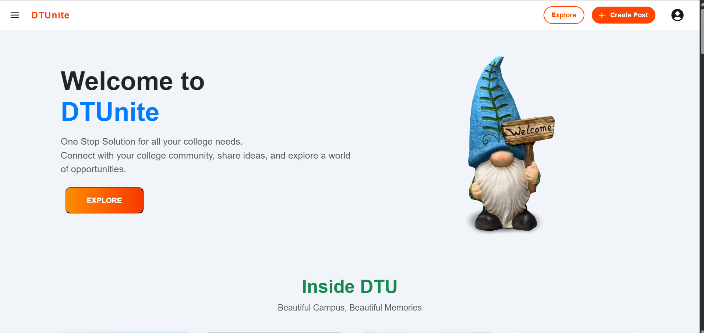
</p>
<p align="center">
  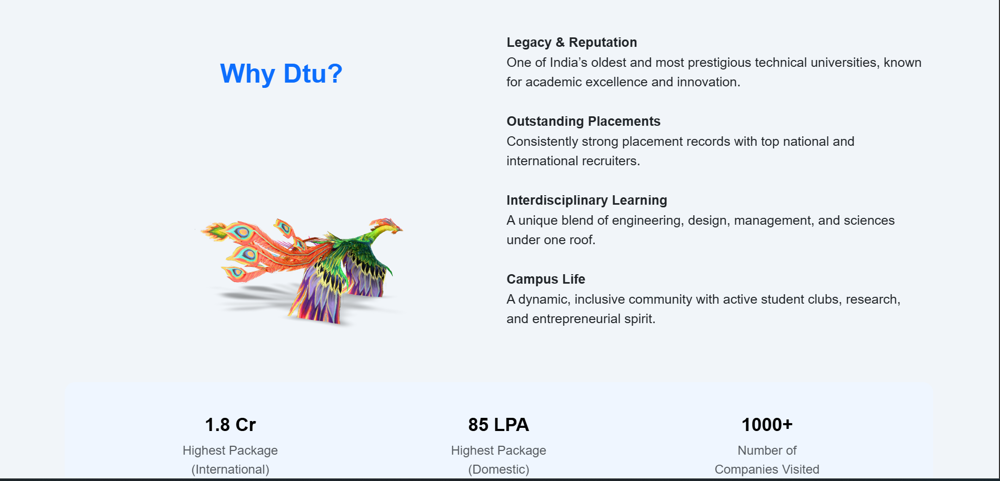
</p>
<p align="center">
  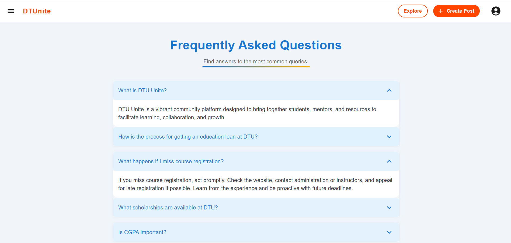
</p>
<p align="center">
  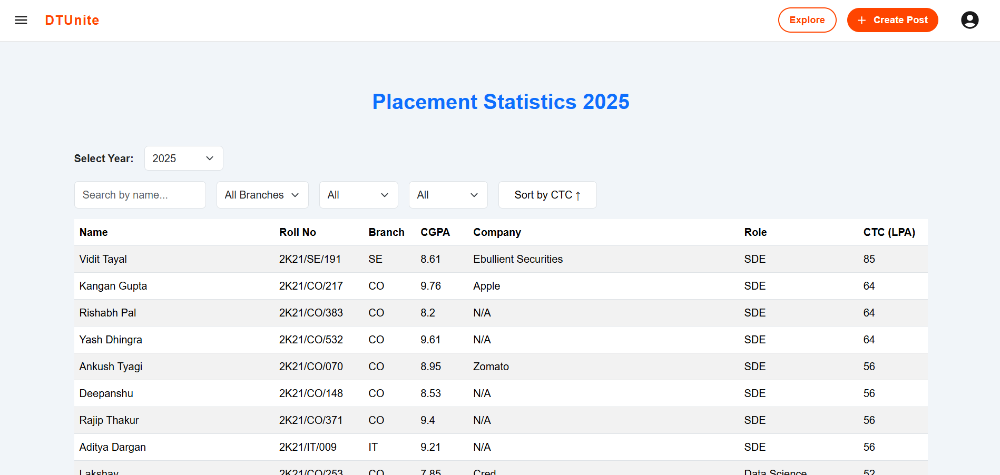
</p>
<p align="center">
  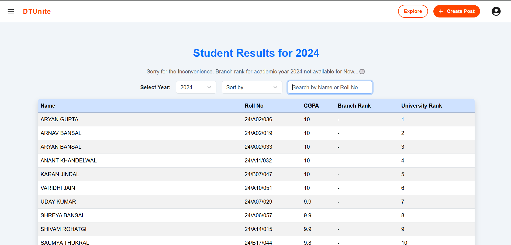
</p>
<p align="center">
  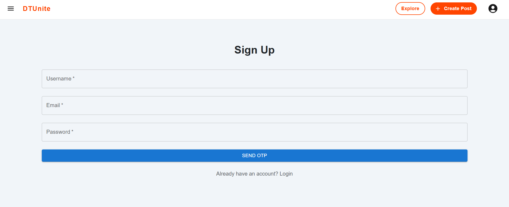
</p>
<p align="center">
  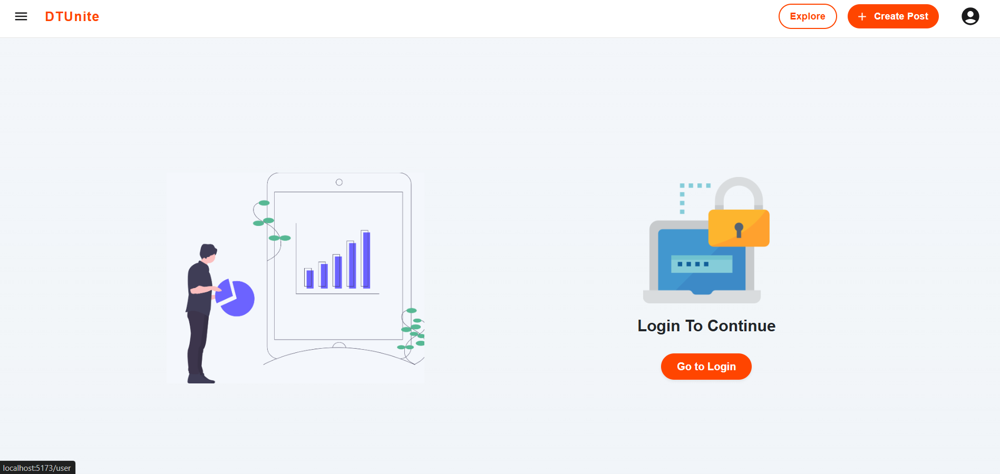
</p>
<p align="center">
  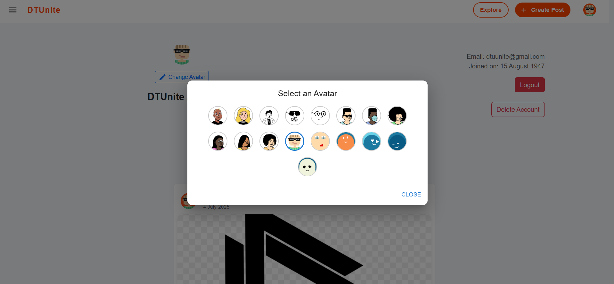
</p>
<p align="center">
  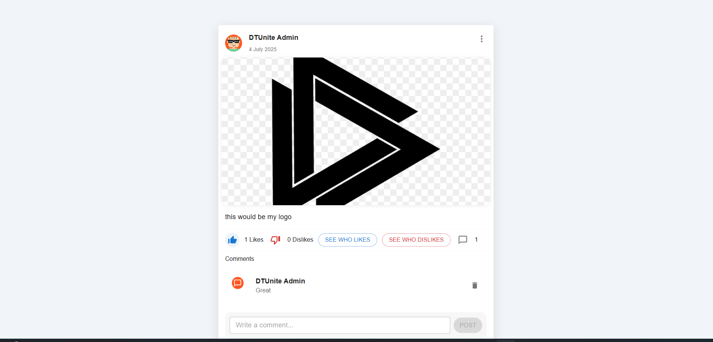
</p>
<p align="center">
  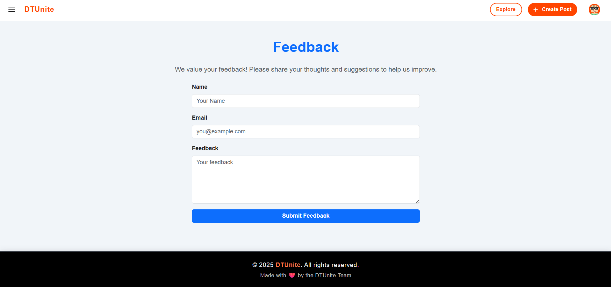
</p>
<p align="center">
  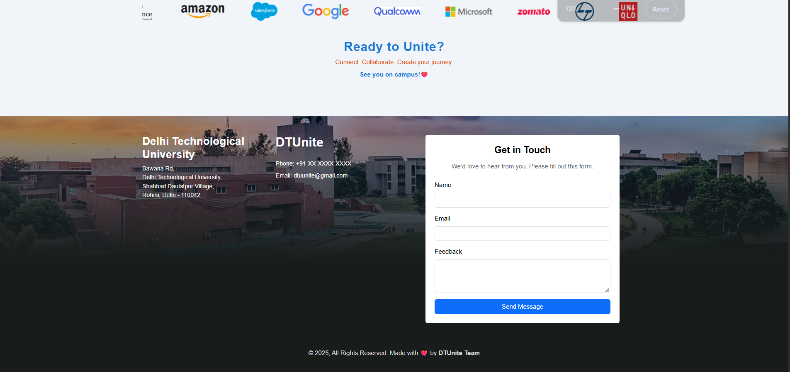
</p>

---

## 🤝 Contributing

This project is developed and maintained by me for the DTU community.  
If you have suggestions or want to contribute, feel free to open an issue or contact me directly.  
All contributions will be reviewed before acceptance.

---

## 🛡️ Security

**Important:**  
If you accidentally commit your `.env` file, remove it from git history and change all secrets immediately.

---

## 📄 License

This project is proprietary and not licensed under MIT or any open-source license.  
Please do not use or redistribute the code without permission.

---

## 🙏 Acknowledgements

- DTU Community for inspiration and feedback
- [Material UI](https://mui.com/)
- [Bootstrap](https://getbootstrap.com/)
- [MongoDB Atlas](https://www.mongodb.com/cloud/atlas)
- [Cloudinary](https://cloudinary.com/)
- [Nodemailer](https://nodemailer.com/)

---

Made with ❤️ by the DTU Unite Team